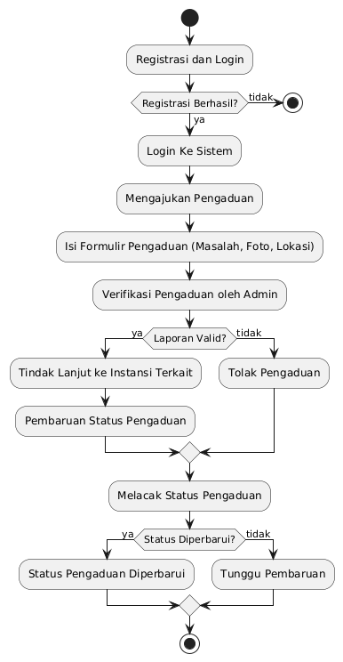
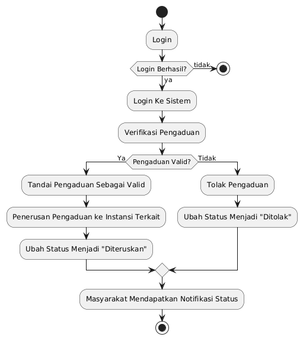

# Analisis Tema Sosial dan Komunitas  
**Studi Kasus**: Sistem Pengaduan Masyarakat Berbasis Website Menggunakan Laravel (Media Pelaporan)

---

# Sistem Pengaduan Masyarakat Berbasis Website (Kelurahan A)

## 1. Latar Belakang  
Sistem pengaduan masyarakat berbasis website ini dikembangkan untuk mempermudah warga **Kelurahan A** dalam menyampaikan laporan terkait kerusakan infrastruktur di lingkungan mereka. Fokus utama sistem ini adalah **media pelaporan** yang mengumpulkan dan mendistribusikan laporan pengaduan kepada pihak kelurahan, tanpa menangani proses perbaikan di dalam sistem.

Laravel Filament digunakan untuk membangun admin panel, dan Docker untuk memastikan sistem berjalan secara konsisten di lingkungan yang berbeda.

---

## 2. Kebutuhan Sistem  

### **Fokus Pengaduan**  
Fokus pengaduan dalam sistem ini ditujukan untuk masalah-masalah infrastruktur yang terjadi di wilayah Kelurahan A. Pengaduan ini mencakup kerusakan fisik yang mempengaruhi fasilitas umum seperti jalan yang rusak, saluran air yang tersumbat, dan berbagai masalah infrastruktur lainnya. Untuk memastikan laporan yang diterima sesuai dengan tujuan sistem, pengaduan harus dilengkapi dengan foto yang jelas serta informasi lokasi yang akurat. Penting untuk diingat bahwa sistem ini hanya menerima pengaduan yang terkait dengan infrastruktur di Kelurahan A, sehingga laporan yang diluar cakupan ini tidak akan diproses.

### **Kebutuhan Stakeholder**  
Terdapat dua stakeholder utama dalam sistem ini, yaitu Masyarakat dan Pengelola (Admin Kelurahan A). Masyarakat memiliki peran untuk melaporkan masalah-masalah infrastruktur yang mereka temui di wilayah Kelurahan A. Agar laporan mereka dapat diproses dengan baik, setiap pengaduan harus disertai dengan foto dan lokasi. Di sisi lain, Pengelola (Admin Kelurahan A) bertugas menerima laporan dari masyarakat, memverifikasi keakuratan informasi yang diterima, dan meneruskan pengaduan kepada pihak-pihak terkait yang dapat menangani masalah tersebut di tingkat kelurahan.

### **Solusi Teknologi** 
Untuk mendukung kelancaran proses pengaduan, solusi teknologi yang digunakan adalah sebuah formulir pengaduan berbasis web. Formulir ini memudahkan masyarakat dalam mengajukan laporan, dengan fitur unggahan foto dan pencantuman lokasi yang memadai. Selain itu, sistem dilengkapi dengan notifikasi otomatis yang akan memberitahu admin kelurahan setiap kali ada laporan baru yang masuk, sehingga proses penanganan pengaduan bisa segera dimulai. Pengguna juga dapat melacak perkembangan pengaduan mereka melalui fitur status, yang memberikan informasi tentang apakah laporan mereka sudah diterima, sedang diproses, atau sudah diteruskan ke pihak yang relevan.

---

## 3. Peran dan Alur Pengaduan  

### **A. Masyarakat**  
Warga Kelurahan A bertugas melaporkan masalah infrastruktur melalui website. Prosesnya:  

1. **Registrasi & Login**: Warga mendaftar dan login ke sistem.
2. **Mengajukan Pengaduan**: Mengisi formulir pengaduan dengan detail masalah, foto, dan lokasi.
3. **Melacak Status Pengaduan**: Masyarakat dapat melihat status pengaduan mereka melalui dashboard.

### **B. Pengelola (Admin Kelurahan A)**  
Admin kelurahan bertugas mengelola laporan pengaduan, tanpa melakukan penanganan langsung. Prosesnya:  

1. **Login**: Admin login ke sistem
2. **Verifikasi Pengaduan**: Admin memeriksa kelengkapan dan keabsahan laporan.
3. **Penerusan Pengaduan**: Mengirimkan laporan pengaduan kepada instansi terkait di kelurahan untuk ditindaklanjuti.
4. **Pembaruan Status**: Mengubah status pengaduan menjadi **"Diteruskan"** setelah laporan diteruskan ke pihak terkait.

⚠ **Catatan**:  
- Tidak ada penanganan langsung di dalam sistem; pengaduan akan diteruskan ke instansi terkait di kelurahan untuk perbaikan.

---

### Flowchart Alur Pengaduan Sebagai Masyarakat

### Flowchart Alur Pengaduan Sebagai Admin

### Usecase Sistem Pengaduan Masyarakat

## 5. Analisis Penggunaan Laravel Filament  

✅ **Kelebihan**:  
- Antarmuka admin yang mudah digunakan untuk mengelola pengaduan dari masyarakat.
- Fitur otomatis untuk memverifikasi laporan dan memperbarui status pengaduan.
- Notifikasi untuk admin ketika ada laporan baru masuk.

⚠ **Tantangan**:  
- Tidak ada pengelolaan atau penyelesaian pengaduan langsung di dalam sistem karena ditangani oleh instansi terkait.

**Mitigasi**:  
- Memungkinkan admin untuk memberikan pembaruan singkat mengenai status pengaduan setelah diteruskan.

---

## 6. Analisis Penggunaan Docker  

✅ **Manfaat Docker dalam Sistem Ini**:  
- Memastikan sistem dapat berjalan dengan stabil pada berbagai lingkungan.
- Memudahkan deployment aplikasi di server kelurahan.
- Memungkinkan skalabilitas jika sistem perlu diperluas.

⚠ **Tantangan**:  
- Pengembang perlu memahami dasar penggunaan Docker.
- Pengelolaan penyimpanan file foto yang besar.

**Mitigasi**:  
- Menggunakan cloud storage untuk menyimpan foto pengaduan dengan aman.

---

## 7. Analisis Dampak  

### **Bagi Masyarakat**  
✅ Masyarakat lebih mudah melaporkan kerusakan infrastruktur yang terjadi di **Kelurahan A**.  
✅ Sistem transparan yang memungkinkan warga melihat status pengaduan mereka.  
⚠ Masyarakat tidak dapat melihat progres penanganan langsung, karena proses perbaikan dilakukan di luar sistem.

### **Bagi Pengelola (Admin Kelurahan A)**  
✅ Admin lebih mudah menerima dan mengelola pengaduan masyarakat.  
✅ Menyediakan catatan riwayat pengaduan yang jelas.  
⚠ Admin tidak memiliki kontrol langsung atas penyelesaian pengaduan karena proses penanganan dilakukan di luar sistem.

---

## Database Schema

### Tabel `users` (Pengguna)
| Kolom       | Tipe Data     | Deskripsi                                       |
|-------------|---------------|-------------------------------------------------|
| `id`        | BIGINT (PK, AI) | ID unik pengguna.                              |
| `name`      | VARCHAR(255)    | Nama lengkap pengguna.                         |
| `email`     | VARCHAR(255)    | Email pengguna (unik).                         |
| `password`  | VARCHAR(255)    | Password terenkripsi.                          |
| `role`      | ENUM('admin', 'masyarakat') | Peran pengguna.                         |
| `created_at`| TIMESTAMP      | Waktu pembuatan akun.                          |
| `updated_at`| TIMESTAMP      | Waktu terakhir update.                         |

### Tabel `pengaduans` (Pengaduan)
| Kolom       | Tipe Data     | Deskripsi                                       |
|-------------|---------------|-------------------------------------------------|
| `id`        | BIGINT (PK, AI) | ID unik pengaduan.                              |
| `user_id`   | BIGINT (FK)    | ID pelapor (relasi ke `users.id`).              |
| `judul`     | VARCHAR(255)    | Judul pengaduan (contoh: "Jalan Berlubang").    |
| `deskripsi` | TEXT           | Detail pengaduan.                               |
| `lokasi`    | VARCHAR(255)    | Alamat/koordinat lokasi.                       |
| `foto`      | VARCHAR(255)    | Path foto bukti (misal: `/uploads/foto.jpg`).   |
| `status`    | ENUM('menunggu', 'diteruskan') | Status pengaduan.                     |
| `created_at`| TIMESTAMP      | Waktu pengaduan dibuat.                         |
| `updated_at`| TIMESTAMP      | Waktu terakhir update.                         |

### Tabel `notifikasis` (Notifikasi)
| Kolom         | Tipe Data     | Deskripsi                                       |
|---------------|---------------|-------------------------------------------------|
| `id`          | BIGINT (PK, AI) | ID unik notifikasi.                             |
| `user_id`     | BIGINT (FK)    | ID penerima (relasi ke `users.id`).             |
| `pengaduan_id`| BIGINT (FK)    | ID pengaduan terkait (relasi ke `pengaduans.id`). |
| `pesan`       | TEXT           | Isi notifikasi (contoh: "Pengaduan diproses").  |
| `dibaca`      | BOOLEAN        | Status notifikasi (true = sudah dibaca).        |
| `created_at`  | TIMESTAMP      | Waktu notifikasi dikirim.                       |

## Relasi Database

### Relasi `users → pengaduans`
- **Jenis Relasi:** One-to-Many
- **Deskripsi:** Satu pengguna bisa membuat banyak pengaduan.

### Relasi `pengaduans → notifikasis`
- **Jenis Relasi:** One-to-Many
- **Deskripsi:** Satu pengaduan bisa memiliki banyak notifikasi.

## Kesimpulan  
Sistem pengaduan masyarakat berbasis website ini hanya berfungsi sebagai **media pelaporan** yang memudahkan masyarakat **Kelurahan A** dalam melaporkan kerusakan infrastruktur. Dengan menggunakan **Laravel Filament** untuk admin panel dan **Docker** untuk deployment yang stabil, sistem ini memberikan kemudahan dalam pengelolaan dan transparansi laporan pengaduan.

**Fitur utama sistem**:
1. **Formulir Pengaduan**: Pengguna dapat melaporkan masalah dengan foto dan lokasi.
2. **Dashboard Admin Kelurahan A**: Admin dapat memverifikasi dan meneruskan laporan ke pihak terkait.
3. **Riwayat Pengaduan**: Masyarakat dapat melihat apakah laporan mereka telah diverifikasi dan diteruskan.

Dengan sistem ini, pengelolaan laporan menjadi lebih cepat, efisien, dan terdokumentasi dengan baik meskipun tindak lanjutnya dilakukan di luar sistem. 🚀
