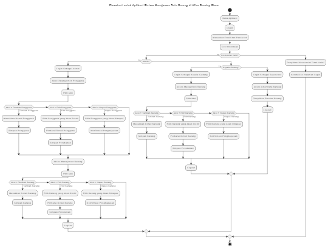

**# **Dokumen Persyaratan Bisnis (BRD)**  
### **Proyek:** Sistem Manajemen Data Barang Pada After Sunday Store  
**Versi:** 1.0
**Tanggal:** 14 November 2024  

---

## **1. Tujuan Proyek**
- **Objektif**: Aplikasi ini bertujuan untuk mempermudah pengelolaan data barang di toko After Sunday, serta memberikan akses yang terstruktur sesuai peran pengguna.

---

## **2. Fitur Utama**

### **Untuk Supervisor**
- **Melihat Data Barang**: Supervisor hanya memiliki hak akses untuk memantau rincian barang yang sudah ditambahkan, tanpa kemampuan untuk mengubah data. Berikut adalah rincian barangnya seperti
  - Nama barang
  - Kategori
  - Stok tersedia
  - Harga satuan
  - Kode barang
  - Keterangan tambahan 

### **Untuk Kepala Gudang**
- **Manajemen Barang**: Kepala gudang bertugas untuk mengelola seluruh data barang, termasuk stok, penambahan, pembaruan, dan penghapusan barang.

### **Untuk Admin**
- **Akses Penuh**: Admin memiliki kontrol penuh atas data barang dan manajemen pengguna, memastikan semua proses berjalan sesuai dengan kebutuhan.

---

## **3. Persyaratan Fungsional**

### **Sistem Login**
- **Akses Berdasarkan Peran**: Supervisor, kepala gudang, dan admin dapat login dengan hak akses berbeda.

### **Pengaturan & Tampilan Barang**
- **Admin**: Mengelola semua data barang dan pengguna.
- **Kepala Gudang**: Mengelola data barang (input, update, delete).
- **Supervisor**: Hanya melihat data barang yang ditambahkan oleh kepala gudang.

---

## **4. Persyaratan Non-Fungsional**

- **Kegunaan**: Antarmuka yang intuitif dan mudah digunakan sesuai peran pengguna.
- **Keamanan**: 
  - Akses terbatas sesuai peran pengguna
  - Admin memiliki akses penuh, kepala gudang dapat mengelola barang, dan supervisor hanya melihat data barang.

---

## **5. Model, Migrasi, Seeder, dan Resource yang Perlu Dibuat Pada Container `docker exec -it sample bash`**

### **Barang**
- **Model**: `Barang`. Menyimpan rincian lengkap tentang barang.
- **Migration**: Struktur tabel berikut ini akan dibuat pada database:
  - `id: bigint UNSIGNED` (Primary Key)
  - `nama: varchar(255)` - Nama barang
  - `stok: int` - Jumlah stok barang
  - `harga_satuan: decimal(10,2)` - Harga satuan barang
  - `kode_barang: varchar(50)` - Kategori barang
  - `keterangan: text` - Keterangan tambahan (opsional)
  - `created_at: timestamp` - Waktu data dibuat
  - `updated_at: timestamp` - Waktu data diubah
- **Seeder**: Data barang awal untuk pengujian.
- **Resource**: Endpoint API untuk data barang, dapat diakses oleh supervisor, kepala gudang, dan admin.
  
### **Permissions**
- **Model**: `Permission`. digunakan untuk menyimpan data permissions dengan atribut berikut:
  - `id`: Primary key dari permission.
  - `name`: Nama dari permission (contoh: create_barang).
  - `guard_name`: Guard untuk permission (default: web).
  
- **Seeder**: `PermissionsSeeder`, bertugas menambahkan permissions dan menetapkannya ke role `admin, kepala gudang dan supervisor`

#### Mengapa Migration Permissions Tidak Dibuat? 

Karena saat membuat proyek baru dengan perintah `composer create-project --prefer-dist raugadh/fila-starter .`, migrasi untuk tabel permissions sudah disediakan oleh spatie/laravel-permission. Paket ini secara otomatis mengatur tabel dan kolom yang diperlukan untuk permissions dan roles, sehingga tidak perlu membuat migrasi permissions secara manual.

---

## **6. Analisis Permissions untuk Admin, Kepala Gudang, dan Supervisor**

Permissions digunakan untuk mengatur akses pengguna sesuai peran mereka di dalam sistem.

### **Permissions yang Diperlukan**

1. **Permissions untuk Admin**
   - Akses penuh untuk mengelola data barang dan pengguna.

2. **Permissions untuk Kepala Gudang**
   - `view_barang`: Mengizinkan kepala gudang melihat barang.
   - `view_any_barang`: Mengizinkan kepala gudang melihat semua barang.

3. **Permissions untuk Supervisor**
   - `view_barang`: Mengizinkan supervisor melihat barang.
   - `view_any_barang`: Mengizinkan supervisor melihat semua barang.

---

## **7. Business Flow System Via Flowchart**

### **Flowchart Sistem Manajemen Data Barang di After Sunday Store**

### **Usecase Sistem Manajemen Data Barang di After Sunday Store**
